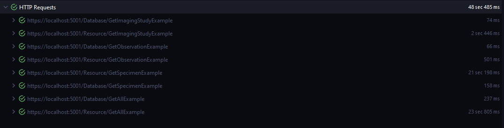

# Spike [21748](https://dev.azure.com/CRISPpointsolutions/PointSolutions/_sprints/taskboard/AyyTeam/PointSolutions/A79%20-%202.21.2022?workitem=21748)

## Background 
The health records proxy application is a demonstration web application that is capable of retrieving `CRISP Specific FHIR Resources` by id using existing API's and underlying datastores.

The goal is to provide an efficient mechanism that can retrieve `Observations`, `Specimens`, and `ImagingStudy` CRISP FHIR Resources and normalize the response to match the view required by in-context.

The web application has 2 controllers with that illustrate _HOW_ to perform a batch search from the microservices.
The application has static get methods for demonstrating data retrieval and normalization to assess differences in the output and response deltas.

The for each Controller there is a `GetAllExample`  action method that will transform the input in request and process it.
Below is an example of the a list of [HealthRecordRequest](src/CRISP.HealthRecordsProxy.Common/APIModels/ServiceResponse.cs) that specify the 
resource name and logical id's to search for. 

The precise way that InContext can be changed but the central idea is as follows:

For each diagnostic report there are `Resource References` for Observations, Specimens, an ImagingStudies. 
```json5
{
  "resourceType" : "DiagnosticReport",
  ... Snipped for Brevity...
  "specimen" : [{ Reference(Specimen) }], // Specimens this report is based on
  "result" : [{ Reference(Observation) }], // Observations
  "imagingStudy" : [{ Reference(ImagingStudy) }], // Reference to full details of imaging associated with the diagnostic report
}
```

For our FHIR Models the reference model above illustrates the specimen, result, and imagingStudy can be distilled down to the 
logical ids without the need to perform the _include for the resources.

As an example, this request assumes that one diagnostic report (or health record line in the app) has 10 associated Observations,
10 Specimens, and 10 imaging studies. This is not a real example but for illustration and performance comparisons between two mechanisms.
```json
[
    {
        "resourceType": "Observation",
        "logicalIdentifier": [
            "21748c07-aa58-a460-8518-1a93f48f424f",
            "c1258861-497d-d89b-c833-17e5cbb246f5",
            "73b70122-b0f9-5ef9-c55f-9855d0f0ab99",
            "7f509afb-6e6a-e11f-6250-4aaeab51a1bf",
            "5c0d29a3-7d67-7441-8901-cec65afad2ae",
            "d2112447-4d52-ad41-7d6a-a9ab63ce5ea9",
            "54f4b253-c2e2-ef81-afda-2a9919411e59",
            "429ffbd4-0059-3dad-468a-abb56c82ff85",
            "692537fb-c2e8-1fe1-bcb5-bc81a80e18a6",
            "f20005db-3c5d-817a-6afe-3de73488ee9e"
        ]
    },
    {
        "resourceType": "Specimen",
        "logicalIdentifier": [
            "ff50d2a0-e3ee-5cbe-916e-e0f5a535cdc1",
            "b3d86f8b-8fdd-c1f6-f7c4-3ac21cd66418",
            "44d79f55-f0df-5059-d6ba-f677092c1ea0",
            "0e08feea-2db7-8f02-1471-351962f3974d",
            "9b4841de-1ef5-8b5c-9d23-e12048572186",
            "aeaeae5b-4db2-3bf6-a7cf-a84810b85612",
            "603d3038-4aa8-d5fd-93f3-a3a020862202",
            "5439307f-9f67-a701-651f-639fe3cf4b57",
            "cb7125ab-c516-bdf1-22b1-80141d1815a7",
            "e4a6a8c4-e7c1-d5fc-b231-4507ba3a193f"
        ]
    },
    {
        "resourceType": "ImagingStudy",
        "logicalIdentifier": [
            "5a1cac61-b61c-b1c3-01d2-5857a83438eb",
            "f1e7cdb4-b48c-a858-c4cd-0906a6dd7929",
            "466fad63-faf0-e42f-acfa-2b1c5d9c272d",
            "d45174e0-0e58-ee54-be84-33c855425358",
            "418c3fa6-427c-b2c5-b1a1-59f38f482c67",
            "5f495b98-c896-a848-9c57-6b862c89ef7e",
            "bae3627b-1e5f-23f3-5e92-6dae624dbcc0",
            "b5ac5b2e-7b40-21b8-a8f8-7a310df04a2d",
            "cf841eba-38c9-0e85-eeba-889935675298",
            "6da1a00d-6d7f-55f2-a0a2-ce70392ef068"
        ]
    }
]
```

For each action method described in this document the same request or subset is used. In addition, the Mechanism in which InContext uses to 'normalize' CRISP FHIR models 
into the associated `Overview` Model were directly copy/pasted from InContext to ensure the Input/Output is consistent and useful for assessment to the application team.

### Resource Controller - API Workflow

The `Resource` Controller represents an example mechanism to call for  `Observations`, `Specimens`, and `ImagingStudy` resources directly 
from the microservice with existing API's. This pathway is the _ALMOST IDENTICAL_ to the way diagnostic report pulls the contained resources with the query parameter

`_include=DiagnosticReport:result`
- Performs the get request to the observation microservice

`_include=DiagnosticReport:specimen`
- Performs the get request to the specimen microservice

`_include=DiagnosticReport:imagingStudy`
- Performs the get request to the imaging study microservice

#### Workflow and Nuances

In order to obtain the FHIR results from the respective app services the following items need to be implemented:
- Add the **extremely important and hyper-specific serializers to the EntryJsonConverter in Startup**
```c#
    EntryJsonConverter.AddOrUpdateMapping<ObservationReportFhirModel>("Observation");
    EntryJsonConverter.AddOrUpdateMapping<SpecimenFhirModel>("Specimen");
    EntryJsonConverter.AddOrUpdateMapping<ImagingStudyFHIRModel>("ImagingStudy");
```
- A series of clients and configurations to talk to the micro-services `/api/_id` endpoints
- A service implementation to handle the requests and conversion to the FHIR model
- The mapping for the FHIR Model to view model (copied from incontext)
- Aggregate and return results in a manner that can be used by incontext


The following endpoint are exposed to fetch individual resources:
```http request
###
GET https://localhost:5001/Resource/GetImagingStudyExample

###
GET https://localhost:5001/Resource/GetObservationExample

###
GET https://localhost:5001/Resource/GetSpecimenExample
```

And provide the following result when called in aggregate:
```http request
GET https://localhost:5001/Resource/GetAllExample
```

```json
{
  "Specimens": [
    {
      "Flag": false,
      "Result": "6.00 mL",
      "Name": "122555007 TEST REGRESSION"
    }
  ],
  "Observations": [
    {
      "Name": "7749411 Sodium",
      "Result": "139.00 mmol/L",
      "Range": "135.00 - 145.00",
      "Comment": "",
      "Status": "final",
      "Interpretation": "Normal",
      "Issued": "2018-12-12T00:00:00.0000000Z"
    },
    {
      "Name": "83628447 POC Urine HCG Result.",
      "Result": "Negative Negative",
      "Range": "Negative",
      "Comment": "",
      "Status": "final",
      "Interpretation": "Abnormal",
      "Issued": "2018-12-12T00:00:00.0000000Z"
    },
    {
      "Name": "7749445 Total Bilirubin",
      "Result": "0.60 mg/dL",
      "Range": "<=1.00",
      "Comment": "",
      "Status": "final",
      "Interpretation": "Normal",
      "Issued": "2018-12-12T00:00:00.0000000Z"
    },
    {
      "Name": "CD:2697951479 eCrCl Adjusted Body Weight",
      "Result": "113.00 \"\"",
      "Range": "",
      "Comment": "eCrCl ABW uses adjusted body weight with a 40% correction in the Cockcroft-Gault formula, and is recommended in obese patients.",
      "Status": "final",
      "Interpretation": "Abnormal",
      "Issued": "2018-12-12T00:00:00.0000000Z"
    },
    {
      "Name": "7749102 Alk Phos",
      "Result": "58.00 unit/L",
      "Range": "45.00 - 117.00",
      "Comment": "",
      "Status": "final",
      "Interpretation": "Normal",
      "Issued": "2018-12-12T00:00:00.0000000Z"
    },
    {
      "Name": "7749958 Albumin",
      "Result": "4.20 g/dL",
      "Range": "3.40 - 5.00",
      "Comment": "",
      "Status": "final",
      "Interpretation": "Normal",
      "Issued": "2018-12-12T00:00:00.0000000Z"
    },
    {
      "Name": "7750141 AST",
      "Result": "19.00 unit/L",
      "Range": "<=37",
      "Comment": "",
      "Status": "final",
      "Interpretation": "Normal",
      "Issued": "2018-12-12T00:00:00.0000000Z"
    },
    {
      "Name": "7750124 ALT",
      "Result": "10.00 unit/L",
      "Range": "12.00 - 78.00",
      "Comment": "",
      "Status": "final",
      "Interpretation": "Below low normal",
      "Issued": "2018-12-12T00:00:00.0000000Z"
    },
    {
      "Name": "7750362 L-Index",
      "Result": "None None",
      "Range": "None",
      "Comment": "",
      "Status": "final",
      "Interpretation": "Normal",
      "Issued": "2018-12-12T00:00:00.0000000Z"
    },
    {
      "Name": "7749446 Total Protein",
      "Result": "6.80 g/dL",
      "Range": "6.40 - 8.20",
      "Comment": "",
      "Status": "final",
      "Interpretation": "Normal",
      "Issued": "2018-12-12T00:00:00.0000000Z"
    }
  ],
  "ImagingStudy": [
    {
      "ViewUrl": "https://apimgmt-dev-crisp.azure-api.net/imagingstudy/view/f1e7cdb4-b48c-a858-c4cd-0906a6dd7929?token=2c63f974-2891-4cb8-8b16-bb3a8faf1133"
    },
    {
      "ViewUrl": null
    },
    {
      "ViewUrl": "https://apimgmt-dev-crisp.azure-api.net/imagingstudy/view/418c3fa6-427c-b2c5-b1a1-59f38f482c67?token=4a2ee65c-5b2b-4127-b365-69e4d4247dc9"
    },
    {
      "ViewUrl": null
    },
    {
      "ViewUrl": "https://apimgmt-dev-crisp.azure-api.net/imagingstudy/view/d45174e0-0e58-ee54-be84-33c855425358?token=a4fa80d1-8356-48c9-9070-d4b8b1c76193"
    },
    {
      "ViewUrl": "https://apimgmt-dev-crisp.azure-api.net/imagingstudy/view/5a1cac61-b61c-b1c3-01d2-5857a83438eb?token=b8a79f47-2e7d-4cd7-a0c5-e5fc0430ac8e"
    },
    {
      "ViewUrl": "https://apimgmt-dev-crisp.azure-api.net/imagingstudy/view/5f495b98-c896-a848-9c57-6b862c89ef7e?token=62f058f5-fd33-4153-ae7b-b9001022d6cd"
    },
    {
      "ViewUrl": "https://apimgmt-dev-crisp.azure-api.net/imagingstudy/view/b5ac5b2e-7b40-21b8-a8f8-7a310df04a2d?token=51e19352-bea2-40b1-b602-7719de003c70"
    },
    {
      "ViewUrl": "https://apimgmt-dev-crisp.azure-api.net/imagingstudy/view/cf841eba-38c9-0e85-eeba-889935675298?token=96d1e16b-ddf5-4215-8ebd-4754ea9dbe8d"
    }
  ]
}
```

From the above request the response provided shows that for 10 logical ids provided for each resource issue a get request to the endpoint for each respective service 
to obtain the FHIR resource. We are not guaranteed to always get back what we ask but that same assumption is implicitly made by diagnostic report.

One nuance here is that the models be deserialized and concerted correctly. I believe this has been done so here correctly but actual implementation would require further verification.

#### How does this mechanism work?
Under the hood the way we get any of these resources can be generalized down to this single method:
```c#
private async Task<IEnumerable<TOut>> ExecuteFhirRequest<TOut>(IList<Guid> ids, string resourceName)
{
    var client = CreateClient(resourceName);
    var query = "?" + string.Join("&", ids.Select(id => $"_id={id}"));
    var request = new HttpRequestMessage(HttpMethod.Get, query);

    // Set the headers for the request
    request.Headers.Add("Username", SystemUserName);
    request.Headers.Add("Orgname", SystemOrganization);

    try
    {
        var response = await client.SendAsync(request);
        var isBundle = TryHandleBundle(response, out Bundle bundle);
        if (isBundle)
            return bundle.Entry.Where(x => x.BaseEntryResource is TOut)
                .Select(x => x.BaseEntryResource)
                .Cast<TOut>();

        return null;
    }
    catch (Exception exception)
    {
        _logger.LogError(exception, "An exception has occured while attempting to obtain the FHIR Resource");
        throw;
    }
}
```
The difficulty here is knowing how to access the entry and attaching the specific serializer. The models provided for the FHIR 
resource from the packages:
```xml
    <ItemGroup>
        <PackageReference Include="CRISP.Providers.ImagingStudy" Version="3.0.0" />
        <PackageReference Include="CRISP.Providers.Observation" Version="3.0.0" />
        <PackageReference Include="CRISP.Providers.Specimen" Version="3.0.0" />
    </ItemGroup>
```
Require initialization of a specific serializer to obtain the model. From there the resource can be directly fed into the existing 
constructor for the incontext overview model and returned. 

This approach is the simplest but performs the slowest:



It can take upwards to 23 seconds to return 10 records from each service in a batch operation like this. It will not be any more
performant than this unless each resource is requested as opposed to their grouping. Generally speaking, specimen has the worst response time for this specific operation. 
The case may be different for other services. 


### Database Controller - Direct Database Access 

As an alternative approach the databases from each microservice were scaffolded using entity framework and the mechanism for how the microservice performs the 
query was replicated throughout the implementations of the actions within the [Database Controller](../CRISP.HealthRecordsProxy/Controllers/DatabaseController.cs)

Each action has an associated repository that follows the same pattern. It is important to note this pattern is more or less the same for each FHIR Database 
but the abstraction is deeply hidden.

```c#
    public class ObservationRepository : IObservationRepository
    {
        private readonly ILogger<ObservationRepository> _logger;
        private readonly IStoreObjects<Guid, ObservationReportFhirModel> _store;
        private readonly ObservationContext _observationContext;

        public ObservationRepository(ILogger<ObservationRepository> logger, ObservationContext observationContext, IStoreObjects<Guid, ObservationReportFhirModel> store)
        {
            _logger = logger;
            _observationContext = observationContext;
            _store = store;
        }

        /// <inheritdoc />
        public async Task<IEnumerable<ObservationReportFhirModel>> QueryByIds(IEnumerable<Guid> ids)
        {
            return (await _observationContext.Observations.Where(s => ids.Contains(s.Id))
                    .Include(s => s.ObservationsJson)
                    .ToListAsync())
                .Select(obs => CreateFhirModel(obs).GetAwaiter().GetResult())
                .ToList();
        }

        private async Task<ObservationReportFhirModel> CreateFhirModel(Context.Models.Observations observations)
        {
            if (observations == null)
                throw new ArgumentNullException("Observations", "Cant be null");

            var observationsJson = observations?.ObservationsJson?.FirstOrDefault()?.Response;

            if (!string.IsNullOrWhiteSpace(observationsJson))
            {
                return JsonConvert.DeserializeObject<ObservationReportFhirModel>(observationsJson);
            }

            try
            {
                var result = await _store.GetValue(observations.Id);
                return result;
            }
            catch (Exception exception)
            {
                _logger.LogError(exception, "Failed to get from storage");
                throw;
            }
        }
    }
```

The above method is how observations technically performs it's operation in the [observation microservice](https://github.com/CRISPHealth/ObservationFHIR/blob/master/app/Models/ObservationContext.cs#L77-L87)
```C#
// This is the abstracted call that happens in observations when diagnostic report calls for the resource by Id 
public async Task<IList<IFHIRDbModel>> QueryByIds(IEnumerable<Guid> ids)
{
    // The IFHIRDbModel is an abstraction from the CRISP.Fhir that makes things difficult to work with in terms of over-all dependancies
    if (ids == null) return new List<IFHIRDbModel>();

    return (await Observations
        .Where(s => ids.Contains(s.Id))
        .Include(s => s.ObservationJSON)
        .ToListAsync())
        // The real magic is inside this method here
        .Select(obs => obs.ToFHIRDbModel(_store))
        .ToList();
}
```
[IFHIRDbModel](https://github.com/CRISPHealth/fhir/blob/develop/src/CRISP.Fhir/Database/IFHIRDbModel.cs)
The `ToFHIRDbModel` is what actually turns the DB call into the model. 
[The model is not simple](https://github.com/CRISPHealth/ObservationFHIR/blob/master/app/Models/ObservationModel.cs#L122)

but to make a long story short the method:
```c#
        public IFHIRDbModel ToFHIRDbModel(IStoreObjects<Guid, ObservationReportFhirModel> store) =>
            new FHIRDbModel(this, store);
```
Is a confusing way to invoke:
```c#
public async Task<Resource> Deserialize(IStoreObjects<Guid, ObservationReportFhirModel> store)
        {
            if (_fhirModel == null)
            {
                if (ObservationJSON?.Response != null)
                {
                    _fhirModel = JsonConvert.DeserializeObject<ObservationReportFhirModel>(ObservationJSON.Response);
                }
                else
                {
                    try
                    {
                        _fhirModel = await store.GetValue(Id);
                    }
                    catch (Exception ex)
                    {
                        if (ex is JsonException) throw;
                        throw new JsonException("JSON retrieval failed", ex);
                    }
                }
            }
            return _fhirModel;
        }

```
Which is important to know when the object:
```C#
        private class FHIRDbModel : IFHIRDbModel
        {
            private readonly ObservationModel _model;
            private readonly IStoreObjects<Guid, ObservationReportFhirModel> _store;
            public Guid Id => _model.Id;
            public string Source => _model.Source;
            public string MRN => _model.SMRN.Split("|")[1];
            // Right here. The source of confusion
            public Task<Resource> Resource => _model.Deserialize(_store);
            public FHIRDbModel(ObservationModel model, IStoreObjects<Guid, ObservationReportFhirModel> store)
            {
                _model = model;
                _store = store;
            }
        }
```
Has a private class in which the constructor takes in the DBModel, internally serializes it, where it injects the `_store` to
rehydrate the json from which it was derived, set it as a resource and then return that back up. 

If that doesnt sound clear it is because it is not. With that said: The implementation of the `ObservationRepository` here mostly does 
what it sound do. It is unclear why the other two resources do not work as expected as they all do the same base operation to some degree. 

There appears to be further magic that requires investigation but we should ask ourselves before we investigate what we want to do with the datastore going forward.